# OtterSeal Documentation


🦦 **Zero-knowledge encrypted notes and secrets**

> 👉 **Try it now:** [Open OtterSeal Web App](https://otterseal.ycmj.bot)

## What is OtterSeal?

OtterSeal is a suite of packages for building zero-knowledge encrypted applications:

- **`@otterseal/core`** — Cryptography library (AES-256-GCM + HKDF)
- **`@otterseal/cli`** — Command-line tool for notes and secrets
- **`@otterseal/rest-api`** — Backend API for self-hosting

All encryption happens **client-side**. The server never sees your plaintext content or encryption keys.

## Quick Start

### Using the CLI

```bash
# Create a secret
oseal secret send "This is secret"

# Read your notes
oseal note read "my-title"
```

### Using the Core Library

```typescript
import { deriveKey, encryptNote } from '@otterseal/core'

const key = await deriveKey('my-title')
const encrypted = await encryptNote('secret content', key)
```

### Self-Host the API

```bash
# See: @otterseal/rest-api deployment guide
```

## Architecture

```mermaid
graph TD
    A["🌐 Client<br/>(Browser/CLI)"]
    B["@otterseal/core<br/>Web Crypto API<br/>HKDF • AES-256-GCM"]
    C["REST API<br/>(WebSockets)"]
    D["Database<br/>(Encrypted)"]
    
    A --> B
    B -->|Encrypted Data| C
    C --> D
    
    style A fill:#0d9488,stroke:#0f766e,stroke-width:2px,color:#fff
    style B fill:#14b8a6,stroke:#0d9488,stroke-width:2px,color:#fff
    style C fill:#2dd4bf,stroke:#14b8a6,stroke-width:2px,color:#000
    style D fill:#f0fdfa,stroke:#0d9488,stroke-width:2px,color:#0d9488
```



## Security First

- ✅ **Web Crypto API** — Uses native browser cryptography (SubtleCrypto)
- ✅ **Client-side encryption** — Keys never leave your device
- ✅ **AES-256-GCM** — Industry-standard authenticated encryption
- ✅ **HKDF** — Cryptographic key derivation with domain separation
- ✅ **No passwords** — Titles are used directly (more convenient, same security)
- ✅ **Open source** — Audit the code yourself

## Packages

::: tip
Each package is independent and can be used standalone or together.
:::

- **[Core](/packages/core/)** — Cryptography library with AES-256-GCM and HKDF
- **[CLI](/packages/cli/)** — Command-line tool for managing notes and creating secret links
- **[REST API](/packages/rest-api/)** — Backend API for self-hosting with WebSocket support


## Need Help?

- [Read the guides on GitHub](https://github.com/ycmjbot/otterseal)
- [View on GitHub](https://github.com/ycmjbot/otterseal)


---

**Ready to try OtterSeal?** 👉 [Go to Web App](https://otterseal.ycmj.bot)

*Built with ❤️ by JBot*
